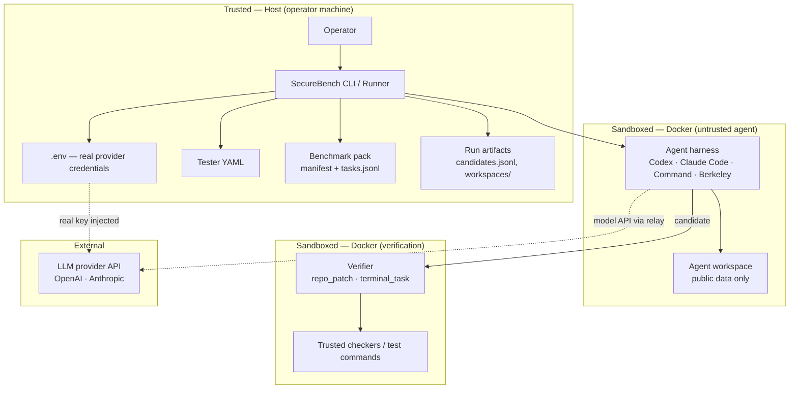
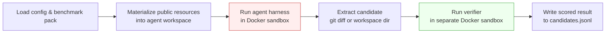
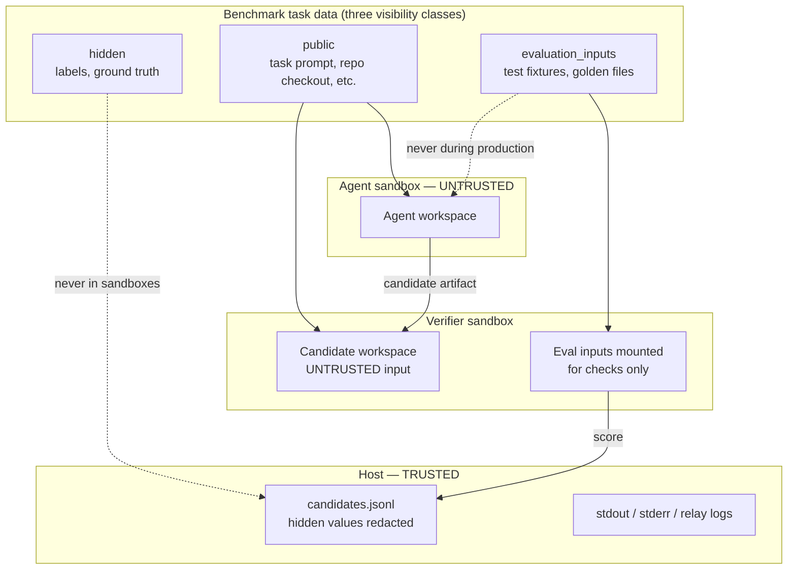
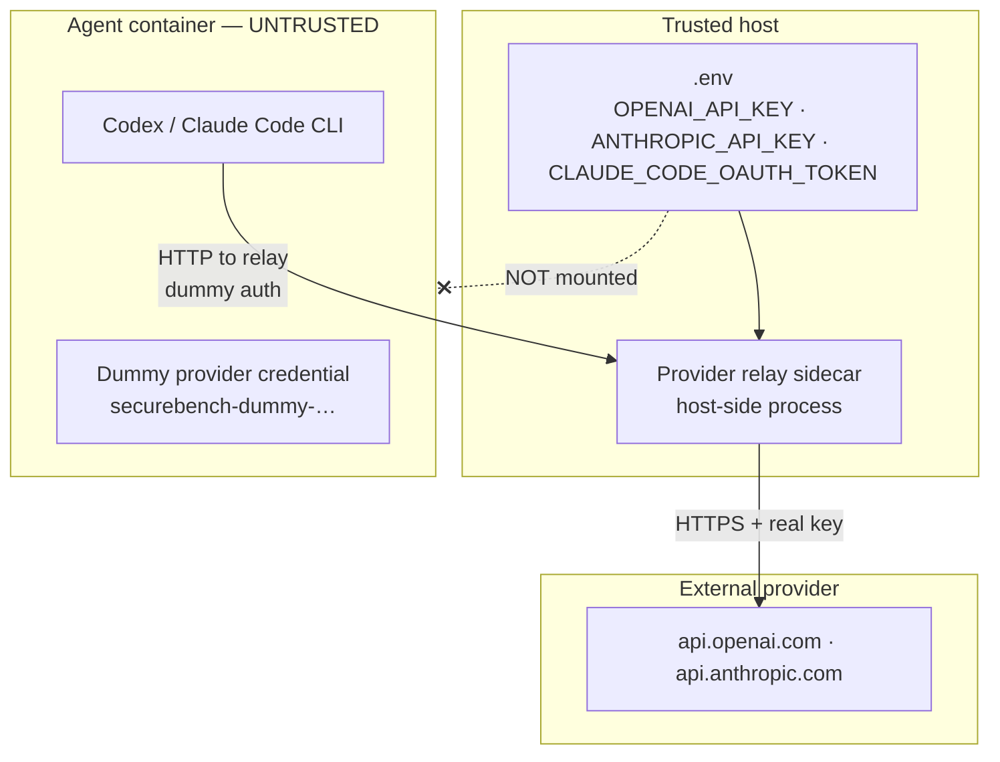
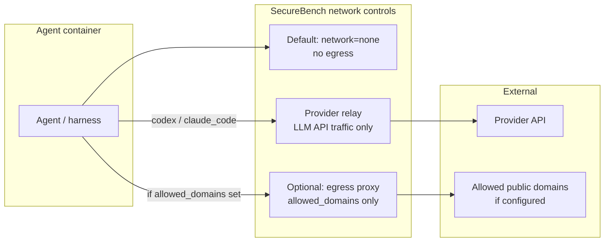
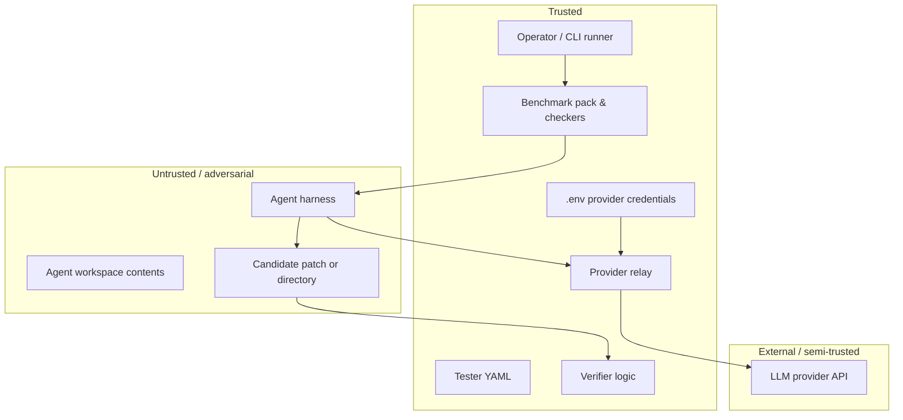
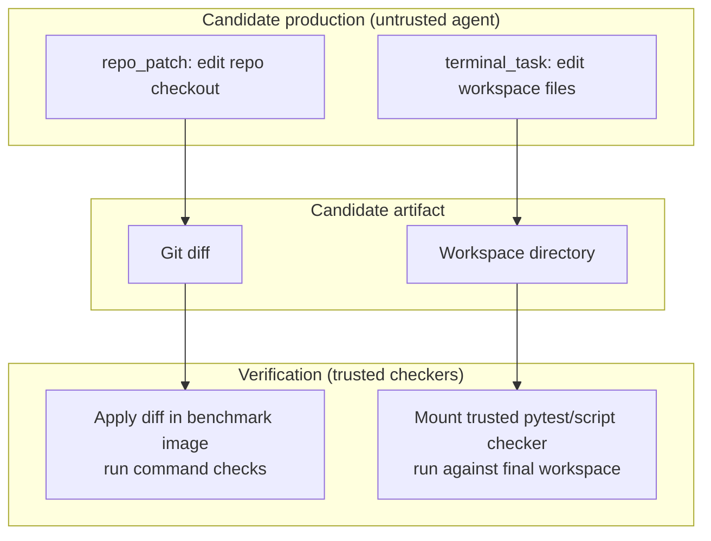
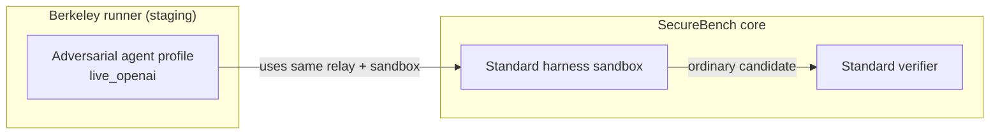

# SecureBench Architecture & Security Diagrams

High-level views for architectural security review. Each diagram covers one concern.
Intended for thesis / professor review; details are deliberately omitted.

**Core trust assumption:** the local operator and benchmark packs are trusted; candidate-producing agents are untrusted and may be adversarial.

---

## 1. System Overview

---

## 2. End-to-End Execution Flow

**Two phases, two sandboxes:** candidate production and verification never share a container. The candidate artifact is treated as hostile input during verification.

---

## 3. Data Visibility & Trust Boundaries

| Visibility | Agent sees | Verifier sees | Result record |
|---|---|---|---|
| `public` | Yes | Yes | Yes |
| `evaluation_inputs` | **No** | Yes | Redacted |
| `hidden` | **No** | Redacted summary | Redacted |

---

## 4. Credential & API Key Placement

**Named provider harnesses** (`codex`, `claude_code`): real credentials stay on the host; the agent container gets a dummy credential and a relay base URL.

**Command harness:** tester-selected env vars pass directly into the container — a different, weaker model. Do not expose real secrets to untrusted command harnesses.

---

## 5. Network & Egress Policy

| Path | Default | Notes |
|---|---|---|
| Generic egress | **Blocked** | Enabled only via `allowed_domains` |
| LLM API (named harnesses) | Via relay | Dummy key in container; real key on host |
| Provider-hosted tools (web search, MCP, etc.) | **Blocked** | Opt-in via `allow_external_tools: true` |

`allowed_domains` limits hostname egress; it is **not** a confidentiality boundary — an allowed domain can still receive exfiltrated data.

---

## 6. Component Trust Classification

| Component | Trust | Isolation | Notes |
|---|---|---|---|
| Operator / CLI runner | Trusted | Host process | Loads config, orchestrates sandboxes |
| `.env` provider credentials | Trusted secret | Host filesystem only | Not mounted into agent containers (named harnesses) |
| Tester YAML | Trusted config | Host filesystem | Defines harness, model, network policy |
| Benchmark pack | **Trusted assumption** | Authored input | Images, checkers, test commands are pack-authored |
| Agent harness + workspace | **Untrusted** | Docker sandbox | Adversarial candidate producer |
| Provider relay | Trusted control plane | Host-side sidecar | Injects credentials; blocks hosted tools |
| Candidate (patch / workspace) | **Untrusted** | Passed to verifier | Treated as hostile during scoring |
| Verifier + checkers | Trusted logic | Separate Docker sandbox | Runs pack-authored checks against untrusted candidate |
| LLM provider | Semi-trusted external | Outside SecureBench | Model API only; hosted tools blocked by default |
| Run artifacts | Mixed | Host filesystem | Public scores + redacted metadata; workspaces may retain sensitive logs |

---

## 7. Benchmark Families (same security model, different artifacts)

Both families share the same visibility model and two-phase sandbox separation; only the candidate shape and verifier mechanics differ.

---

## 8. Berkeley Adversarial Testing (optional layer)

Berkeley agents are candidate producers like any other harness. They see only public task data, produce a normal candidate, and are scored by the existing verifier path.

---

## Security Assumptions to State Explicitly

These are the boundaries a reviewer should challenge:

1. **Benchmark packs are trusted.** Pack-authored Docker images, checkers, and verifier commands execute with verifier trust. SecureBench is not designed to safely run arbitrary third-party packs without additional isolation.
2. **Agents are adversarial.** Anything written by the agent (code, patches, workspace files) is untrusted during verification.
3. **The operator is trusted.** Host filesystem, `.env`, and run orchestration are in the trusted zone.
4. **Docker is the isolation primitive.** Agent and verifier sandboxes use capability-dropped, network-restricted containers; this is container isolation, not a hardware boundary.
5. **Results are not yet tamper-evident.** `--resume` trusts existing `candidates.jsonl`; records lack signed provenance digests (known gap).

See also: [SECURITY.md](./SECURITY.md), [architecture-risk-review.md](./architecture-risk-review.md).
